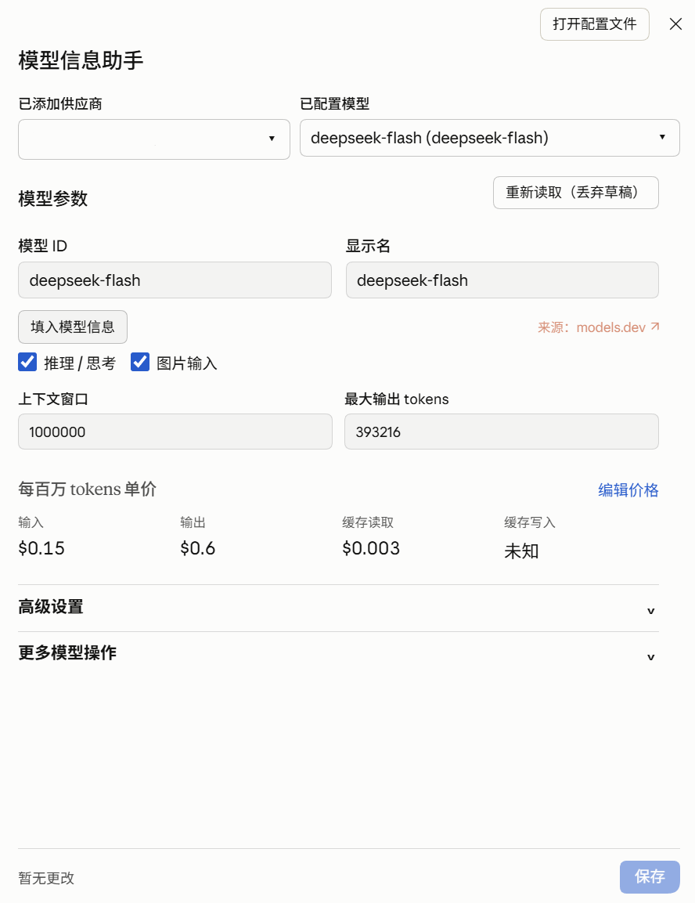

# dsh-model-kit

[English](README.en.md) | 中文

**DeepSeek Harness 模型信息助手：查询模型参数与参考价格，核对后保存到 DSH。**

[安装](#安装) · [快速开始](#快速开始) · [使用说明](docs/editor.md) · [文档索引](docs/README.md) · [开发](docs/development.md)

面向 **DSH Desktop 0.2.x（从 0.2.0-rc.2 起）**，在 **设置 → 模型信息助手** 中管理已配置模型。开发测试基线为 `0.2.0-rc.2`；其他宿主版本的完整功能仍需单独验证，详见 [兼容策略](docs/development.md#宿主版本兼容策略)。

<a href="assets/model-kit-ui.png"></a>

## 功能

| 功能 | 说明 |
| --- | --- |
| 模型信息补全 | 从 Models.dev 查询显示名、上下文窗口、输出上限、文本/图片输入模态及可识别的推理档位 |
| 预览与比较 | 自动推荐先填入草稿，可比较候选来源、选择冲突字段并撤销本次参数填入 |
| 自定义价格 | 编辑输入、输出、缓存读取与缓存写入单价，支持 USD / CNY 和参考价 × 倍率 |
| 上游模型导入 | 通过 DSH 已配置的供应商获取模型列表，选择并预览后追加新模型 |
| 内置模型覆盖 | 按字段覆盖继承目录中的模型参数，也可恢复上层继承 |
| 搜索与刷新 | 按供应商、模型名称或 ID 搜索；宿主列表变更自动刷新，目标仍存在时保留草稿 |

模型参数来自 **Models.dev**；价格可选 **Models.dev（USD）** 或 **basellm（原生 USD / CNY）**。缺失价格保持未知，明确的零价格保留，不自动换汇。来源与匹配规则见 [推荐规则](docs/pi-web-workflow.md) 和 [价格说明](docs/pricing-sources.md)。

## 安装

插件已发布到 [npm：dsh-model-kit](https://www.npmjs.com/package/dsh-model-kit)。使用与桌面端配套的 DSH CLI 安装：

```sh
dsh plugin --profile desktop add dsh-model-kit
```

使用独立 Web profile 时，将命令中的 `desktop` 改为 `web`。安装完成后，从托盘完整退出并重新打开 Desktop，在 **设置 → 模型信息助手** 中确认页面出现。单独执行 `npm install dsh-model-kit` 不会将插件挂载到 DSH profile。

需要离线安装时，可在 Desktop 插件管理界面选择本地预构建 `.tgz` 包。

从源码自行构建本地包需要 **Node.js ≥ 22.19**：

```sh
npm ci
npm pack
```

`npm pack` 会先构建，输出文件名取决于 `package.json` 中的版本。不要直接把未构建源码作为插件安装。

生成的 `.tgz` 可按上述本地包方式安装。

## 快速开始

1. 在 DSH 原生模型设置中添加供应商、协议、API 地址及凭据。
2. 打开 **设置 → 模型信息助手**，依次选择供应商和模型。
3. 点击 **填入模型信息**，核对参数草稿；有分歧时展开 **高级比较**。
4. 需要设置价格时展开 **编辑价格**，选择币种、数据源和定价模式。
5. 点击 **保存**，查看结果。需要新增模型或修改内置模型时展开 **更多模型操作**。

保存通过 DSH 官方 Settings 接口完成。配置已被其他操作修改时会拒绝旧版本写入，需重新读取后再编辑。

## 使用前了解

- **最大输出会影响请求行为。** 显式保存 `maxTokens` 也会设置每次请求的默认输出上限。
- **补全有明确例外。** 已有名称、容量和具体推理档通常保留；图片能力以及 false/空推理档可被可靠建议补入草稿，保存前可核对或撤销。
- **推理支持是部分识别。** 自动读取可识别的 effort 档位；仅有思考开关或预算信息时不推断档位。手动首次启用默认 `medium`，不代表已经验证接口支持。
- **显示的是单价，不是费用账单。** 价格保存在插件配置，当前不计算会话费用，也不接入 DSH 原生费用统计。分时、阶梯及其他复杂计费不自动压成固定价格。
- **更换币种会替换该模型原币种价格。** 不同时保留两套币种，也不进行汇率换算。

## 数据与隐私

启动不自动联网、不自动改写模型。目录按操作需要在宿主端查询；上游发现由 DSH 官方服务使用已有凭据，插件不向前端返回 API Key，也不将其发送给参考目录。

模型参数与价格经 Settings 写入当前 profile 的 `cordis.patch.yml`，不直接操作旧 `settings.yaml`。修改范围和冲突规则见 [Settings 接入](docs/settings.md)。

## 文档与反馈

- [完整使用说明与常见问题](docs/editor.md)
- [数据匹配与推荐规则](docs/pi-web-workflow.md)
- [价格、币种与倍率](docs/pricing-sources.md)
- [开发与技术文档索引](docs/README.md)

反馈问题时请附宿主版本、插件包版本、操作步骤和已脱敏的错误信息。不要附 API Key 或完整 profile 配置。

## 致谢

感谢 [pi-web](https://github.com/agegr/pi-web)、[dsh-models-dev](https://github.com/M4cd1r/dsh-models-dev) 和 [dsh-model-pricing](https://github.com/vitas/dsh-model-pricing) 的参考。本项目使用 [MIT 许可证](LICENSE)；代码来源与第三方声明见 [参考记录](docs/references.md) 和 [THIRD_PARTY_NOTICES.md](THIRD_PARTY_NOTICES.md)。
